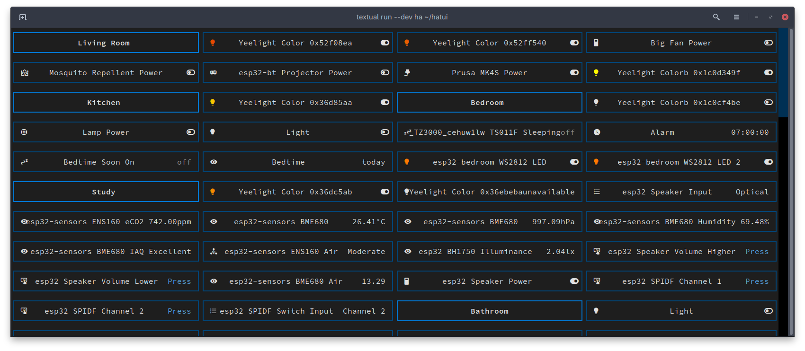

# hatui

A Terminal User Interface (TUI) Home Assistant dashboard using the Textual library.



## Features

  * [x] Displays the same entities you see on the default Lovelace dashboard
  * [x] ~Entities grouped the same~ this isn't properly possible with Textual at the moment, but it's sort of implemented
  * [x] Entities display their friendly name
  * [x] Most entity states are humanised and displayed with their units
  * [x] Entities states update in realtime
  * [x] Entity icons are displayed (assumes you have Nerdfonts installed)
  * [x] Lights are coloured, same as the UI
  * [ ] Animation on refresh (without colouring artefacts...)
  * [ ] Full implementation of reactive icons
  * [ ] Full implementation of state translations
  * [ ] Translation of sensor group names
  * [ ] Ordering of groups identical to Lovelace
  * [ ] Interactivity (requires a bit of a refactor to enable receiving out-of-order responses)
  * [ ] Refresh on adding/removing entities
  * [ ] Progress bar on first load

## Usage

```shell
pipx install git+https://github.com/aarongorka/hatui.git
export HATUI_WS_URL=ws://<your HA hostname>:8123/api/websocket
export HATUI_TOKEN=<token obtained from your profile on the left sidebar -> security tab -> long-lived access tokens>
hatui
```

Or for debugging:

```shell
textual console --exclude 'EVENT'
```

```shell
textual run --dev hatui.main:run
```
